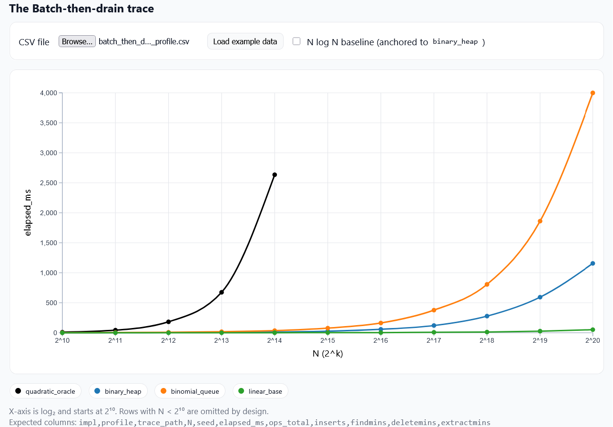

# Empirical Comparison of Binary Heap and Binomial Queue for Sorting using Batch-Then-Drain
## Abstract
I compared Binary Heaps, Binomial Queues, the $N^2$ Quadratic Oracle, and a Linear Baseline under the batch-then-drain profile, which models offline sorting via repeated extract-min operations. Traces were generated with fixed seeds and verified against both the quadratic oracle and the linear baseline. Timing was performed using a harness that measures only the replay loop.
## Question
How do Binary Heaps, Binomial Queues, the $N^2$ Oracle, and the Linear Baseline behave under the batch-then-drain workload used in offline sorting, where the queue is built once and drained entirely using extract-min operations?
## Hypothesis
I hypothesize that the Binary Heap will be the fastest structure because each extract-min requires $O(\log n)$ time, giving a total runtime of approximately $O(n \log n)$ for the batch-then-drain phase. Binomial Queues will be slower due to their more complex tree-merging costs. The Linear Baseline will scale poorly because both finding and deleting the minimum element require$O(N)$ time, making the total work quadratic. Finally, the $N^2$ Oracle is expected to exhibit quadratic growth.

## Method
The `findMin`, `insert`, `deleteMin` and `extractMin` were part of my API. Traces for the batch-then-drain profile were generated using fixed seeds and included exactly **N inserts followed by N extract-min operations**with keys drawn uniformly from the range $[1, 2^{20}]$. I evaluated four implementations, **Binary Heap**, **Binomial Queue**, **Linear Baseline**, and the **Quadratic Oracle** on my personal computer using Clion.

# Results

The Plot shows that binary heaps perform faster than binomial queues by a lot and that the trend is $O(n \log n)$ whereas the linear-baseline appears flat. The oracle became asymptotic around $2^15$

# Interpretation tied to the batch-then-drain pattern
I thought that the linear baseline would get impractical due to the sorting required when inserting to find the minimum value but that was not the case. It performed linearly.  The batch-then-drain profile builds using the data structure offline and then extracts min to give us a sorted output like the one required when using heap-sort. Binomial queues could have been the same theoretically but because of their structure they performed the worst. Overall, the curves reflect exactly what the batch-then-drain pattern predicts: performance is determined by how efficiently each structure supports repeated delete-min operations